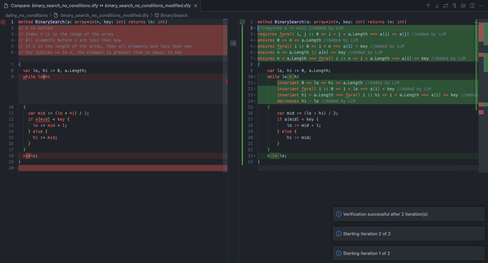

# Dafny Autopilot for VS Code

Dafny Autopilot is an AI tool leveraging GPT-4o / Claude 3.5 Sonnet to verify that the code your Copilot writes is correct.
 

## Features 🎯

* Given an incomplete Dafny `.dfy` program with missing verification annotations, Dafny Autopilot uses LLM to fill in the annotations & automatically verify the resulting Dafny program.
 

## Installataion 🔧

1. Install Dafny on your machine by following [this tutorial](https://dafny.org/dafny/Installation).
2. You may need to install `Z3` and `dotnet` as well.
3. `node v20` is recommended.
4. To use GPT models, you'll need an OpenAI API key. To use Claude models, you'll need an Anthropic API key (which you'll be prompted to input when you start using Dafny Autopilot).
5. <i>(Optional)</i> Install [the Dafny for Visual Studio Code extension](https://marketplace.visualstudio.com/items?itemName=dafny-lang.ide-vscode) (for better syntax & error highlighting).
 

## How to Use 💻
1. On the first start, right-click on a `.dfy` file, and select `Dafny Autopilot: Fill in Dafny Annotations`.
   1. This will prompt you to enter <b><i>OpenAI or Anthropic API key</i></b> to use their corresponding LLMs.
   2. This will prompt you to enter the <b><i>path to Dafny executable</i></b> (which is used for verification), e.g., `/opt/homebrew/bin/Dafny`.
   3. This will also prompt you to enter the <b><i>maximum number of iterations</i></b> you'd like to give to LLM.
      1. For example, if you enter max # of iterations = 2, then if LLM fails to filling in correct annotations at its first attempt, it'll be given a second attempt, where it also receives error messages from Dafny verifier from the first attempt.
2. Wait for LLM to fill in annotations & Dafny to verify.
3. After filling in annotations is done, you'll see the complete `.dfy` file output by LLM compared against the incomplete input program, as well as success or error message at the bottom right corner.
 

  

 

## Extension Settings ⚙️

* `dafny-autopilot.dafnyPath`: Path to your Dafny executable (e.g., `/opt/homebrew/bin/Dafny`)
* `openai.apiKey`: Your OpenAI API key (for using GPT models)
* `anthropic.apiKey`: Your Anthropic API key (for using Claude models)
 

## Building Locally

1. Run `npm install`.
2. In VS Code, `Run` or `Run with Debugging` the extension.
3. In VS Code test window, open a `.dfy` file.
4. Right-click on the file, either in the VS Code Explorer or Editor, and select which command to run.
5. To view logs, open the VS Code bottom panel, select the `Output` tab, and from the bottom panel's dropdown, select the `Dafny Autopilot` channel.
 

## Known Issues

We're working on improving LLM prompting to increase the verification success rate.
  

## Release Notes

### 1.0.0

Initial release.
  

## Contributions

Contributions are always welcome. Dafny Autopilot is an MIT-licensed open-source project.
